### Hi 👋, I'm Jinhai

- :wrench: I am a software development engineer working at a top tier company in the information technology industry. Please check my [LinkedIn](https://fr.linkedin.com/in/jinhaizhou)
- :black_nib: I write blogs on various topics, from interview questions to real world system designs. Please find them at
  - :us: www.zhoujinhai.me
  - :cn: www.codingnote.com
- :star: I like drawing and designing UI/UX stuff. For example, here is a radar graph that I recently designed to show my software development competencies.
  

<!--
**JinhaiZ/JinhaiZ** is a ✨ _special_ ✨ repository because its `README.md` (this file) appears on your GitHub profile.

Here are some ideas to get you started:

- 🔭 I’m currently working on ...
- 🌱 I’m currently learning ...
- 👯 I’m looking to collaborate on ...
- 🤔 I’m looking for help with ...
- 💬 Ask me about ...
- 📫 How to reach me: ...
- 😄 Pronouns: ...
- ⚡ Fun fact: ...
-->
